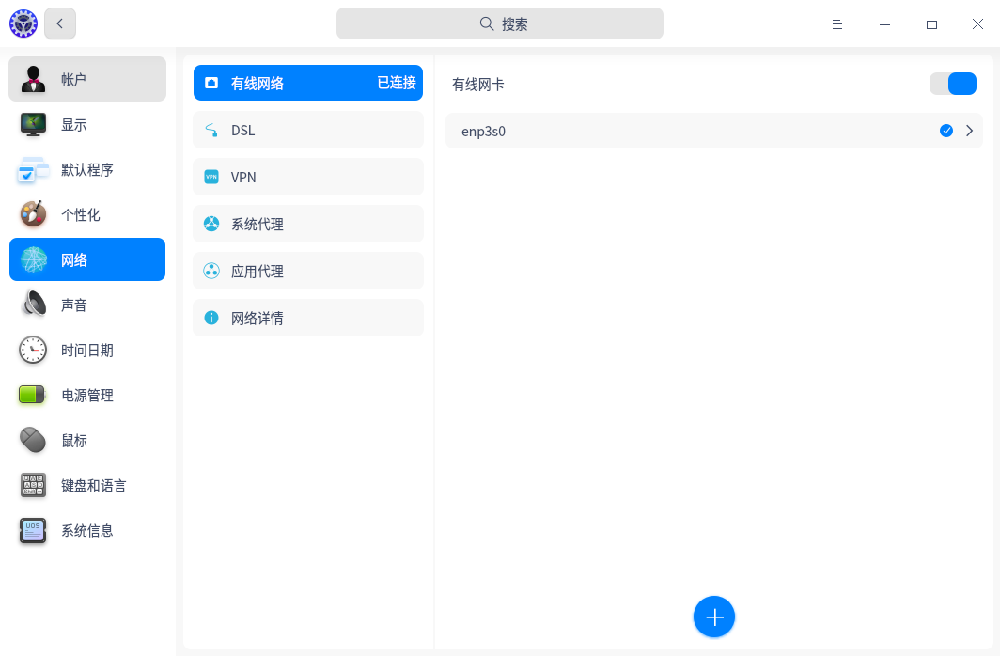

# dde-network-utils

#### 介绍
dde网络设置，登录系统后，您需要连接网络，才能接收邮件、浏览新闻、下载文件、聊天、网上购物等。

#### 软件架构
全平台

#### 安装教程

dnf install dde-network-utils

#### 使用说明

您可以通过打开控制中心-网络，查看当前网络状态。

1. 有线网络

   有线网络安全快速稳定，是最常见的网络连接方式。当您设置好路由器后，把网线两端分别插入电脑和路由器，即可连接有线网络。

   1）将网线插入电脑上的网络插孔。

   2）将网线的另一端插入路由器或网络端口。

   3）在控制中心首页，单击。

   4）单击**有线网络**，进入有线网络设置界面。

   5）打开**有线网卡**，开启有线网络连接功能。

   6）当网络连接成功后，桌面右上角将弹出**已连接有线连接**的提示信息。

   您还可以在有线网络的设置界面，编辑或新建有线网络设置。

2. 拨号网络（DSL）

   拨号上网（DSL）是指通过本地电话拨号连接到网络的连接方式。配置好调制解调器，把电话线插入电脑的网络接口，创建宽带拨号连接，输入运营商提供的用户名和密码，即可拨号连接到Internet上。

   新建拨号连接步骤：

   1）在控制中心首页，点击。

   2）单击**DSL**，单击。

   3）输入宽带名称、帐户、密码。

   4）单击**保存**，系统自动创建宽带连接并尝试连接。

3. VPN

   VPN即虚拟专用网络，其主要功能是在公用网络上建立专用网络，进行加密通讯。无论您是在外地出差还是在家中办公，只要能上网就能利用VPN访问企业的内网资源。您还可以使用VPN加速访问其他国家的网站。

   1）在控制中心首页，单击 。

   2）点击**VPN**，选择或者。

   3）选择VPN协议类型，并输入名称、网关、帐号、密码等信息。（导入VPN会自动填充信息）

   4）点击**保存**，系统自动尝试连接VPN网络。

   5）您可以将VPN设置导出，备用或共享给其他用户。

   > 说明：*打开 **仅用于相对应的网络上的资源** 开关，可以不将VPN设置为默认路由，只在特定的网络资源上生效。*

4. 系统代理

   1）在控制中心首页，单击。

   2）单击 **系统代理**，进入系统代理界面。

   3）单击**无**，关闭代理服务器功能。

   4）单击**手动**，输入代理服务器的地址和端口信息。

   5）单击**自动**，输入URL，系统将自动配置代理服务器的信息。

5. 应用代理

   1）在控制中心首页，单击。

   2）单击**应用代理**。

   3）设置应用代理参数。

   4）单击**保存**。

   > 说明：*应用代理设置成功后，打开启动器，右键单击应用图标，可以选择 **使用代理**。*

6. 网络详情

   在网络详情界面，您可以查看MAC、IP地址、网关和其他网络信息。

   1）在控制中心首页，单击。

   2）单击**网络详情**，进入网络信息界面。

   3）查看当前有线网络或无线网络的信息。

   

#### 参与贡献

1.  Fork 本仓库
2.  新建 Feat_xxx 分支
3.  提交代码
4.  新建 Pull Request

#### 码云特技

1.  使用 Readme\_XXX.md 来支持不同的语言，例如 Readme\_en.md, Readme\_zh.md
2.  码云官方博客 [blog.gitee.com](https://blog.gitee.com)
3.  你可以 [https://gitee.com/explore](https://gitee.com/explore) 这个地址来了解码云上的优秀开源项目
4.  [GVP](https://gitee.com/gvp) 全称是码云最有价值开源项目，是码云综合评定出的优秀开源项目
5.  码云官方提供的使用手册 [https://gitee.com/help](https://gitee.com/help)
6.  码云封面人物是一档用来展示码云会员风采的栏目 [https://gitee.com/gitee-stars/](https://gitee.com/gitee-stars/)
